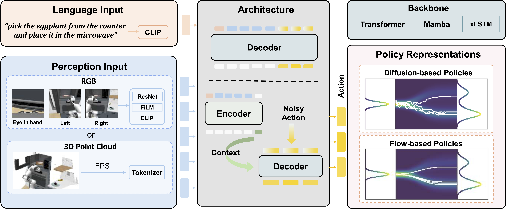

# X-IL: Exploring the Design Space of Imitation Learning Policies
This repository is still under construction. If you find any issues, please let us know and we will try to fix it as soon as possible. Thank you for your understanding.
-
[Arxiv](https://arxiv.org/abs/2502.12330)

<p align="center">

  

</p>

**X-IL** is an open-source framework designed to systematically explore the design space of Imitation Learning. 
The framework's modular design enables seamless swapping of policy components, such as backbones (e.g., Transformer, Mamba, xLSTM) and policy optimization techniques 
(e.g., Score-matching, Flow-matching). 
This flexibility facilitates comprehensive experimentation and has led to the discovery of novel policy configurations

## News
- **09/03/2025:** Initial release of X-IL.

---
## TODO
We test the current implementation on the LIBERO. Regarding the RoboCasa, 
we have our own implementation of the environment and dataset for the point cloud usage, so we are preparing
a documentation for how to set it up. If you want to check how we get the point cloud, please refer to this 
repository [custom_robocasa](https://github.com/ALRhub/custom_robocasa).
- [ ] Release a documentation for the code
- [ ] Refine RoboCasa
- [ ] Refine base_agent and dataset implementations

---

## Features

- **Observations:** support for language and visual inputs as well as point cloud inputs.
- **Encoders:** support for mlp, resnet, film-resnet and other pretrained models.
- **Architectures:** support for transformer, mamba, xlstm models.
- **Policy Head:** support for bc, ddpm, beso, flow matching.
- **Environments:** support for LIBERO and RoboCasa.

---

## Installation
**!!! Notice that due to dependency differences between LIBERO and RoboCasa, we encourage to install
different conda environments for them.**

To begin, clone this repository locally
```
git clone git@github.com:ALRhub/X_IL.git
```

### Installing requirements
```
conda create -n xil python=3.10
conda activate xil

# adapt to your own cuda version if you need
pip install torch torchvision torchaudio --index-url https://download.pytorch.org/whl/cu118

pip install -r requirements.txt
```

### Installing LIBERO Setup
```
git clone https://github.com/Lifelong-Robot-Learning/LIBERO.git
cd LIBERO
pip install -e .
```

### Installing RoboCasa Setup
```
# if you only want to test image-based inputs on RoboCasa, the original RoboCasa repository is enough.
git clone https://github.com/robocasa/robocasa
cd robocasa
pip install -e .
python robocasa/scripts/download_kitchen_assets.py
```

### Installing packages for mamba1/2
```
# you might have some problems with the installation of mamba, we will try to provide some hints in the incoming documentation.
pip install mamba-ssm[causal-conv1d] --no-build-isolation
```
### install xlstm
```
git clone https://github.com/NX-AI/xlstm.git
cd xlstm
pip install -e . --ignore-requires-python
```

### Installing point cloud visualizer
```
cd visualizer
pip install -e .
```
---

## Usage

### Code Structure
```
X_IL
└── agents                   # Agent implementations       
   └── models                # Policy representations
       └── bc                  
       └── beso            
       ...       
   └── backbones             # Architecture backbones
       └── mamba       
       └── transformer
       └── xlstm
       ...
   └── encoders              # observation encoders
       └── pretrained_resnets.py      
       ...
   └── base_agent.py         # Base agent class
   └── bc_agent.py            
   └── beso_agent.py          
   ...   
└── configs/                 # Configuration files
   └── agents/               # Agent-specific configs
      └── bc_agent.yaml
      └── beso_agent.yaml
      └── vqbet_agent.yaml
   └── trainers/             # Training configs
      └── base_trainer.yaml
   └── libero_config.yaml    # Libero environment
   └── robocasa_config.yaml  # RoboCasa environment
   ...
└── environments/             
   └── dataset/              # Dataset implementations
      └── libero_dataset.py
      └── robocasa_dataset.py
      ...
└── simulation/              # Simulation environments
   └── libero_sim.py         # Libero simulation
   └── robocasa_sim.py       # RoboCasa simulation
   ...
└── trainers/                # Training implementations
   └── base_trainer.py       # Base training logic
└── run.py                   # Main script to run experiments
```

### Quick test on LIBERO
Train decoder-only transformer with `BC` on LIBERO-Object tasks using 20% data and 3 seeds
```
bash scripts/bc/dec/transformer.sh
```
Please adapt the wandb configs and dataset path in the config file.

---
## Acknowledgements

The code of this repository relies on the following existing codebases:
- [Mamba] https://github.com/state-spaces/mamba
- [xLSTM] https://github.com/NX-AI/xlstm
- [MDT] https://github.com/intuitive-robots/mdt_policy
- [D3Il] https://github.com/ALRhub/d3il
- [LIBERO] https://github.com/Lifelong-Robot-Learning/LIBERO
- [RoboCasa] https://github.com/robocasa/robocasa

---
### Citation
If you found the code usefull, please cite our work:
```
@article{jia2025x,
  title={X-IL: Exploring the Design Space of Imitation Learning Policies},
  author={Jia, Xiaogang and Donat, Atalay and Huang, Xi and Zhao, Xuan and Blessing, Denis and Zhou, Hongyi and Zhang, Hanyi and Wang, Han A and Wang, Qian and Lioutikov, Rudolf and others},
  journal={arXiv preprint arXiv:2502.12330},
  year={2025}
}
```